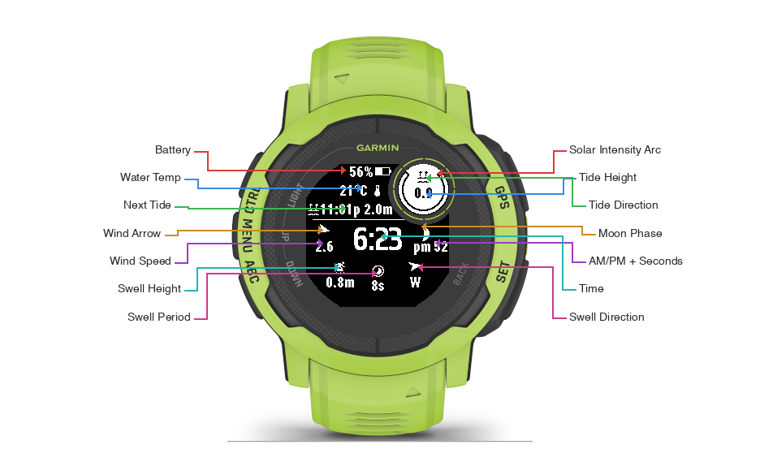
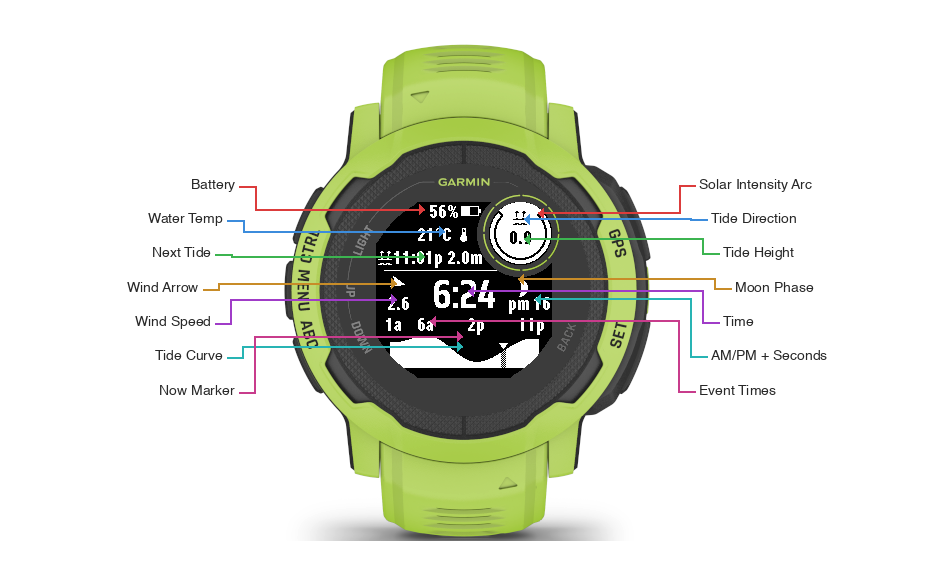

# Surfer Watch

A surfer-focused watch face for the Garmin Instinct series. Two modes: Shore Mode for daily wear with weather, tide, and fitness metrics — and Surf Mode for in-water use with swell, tide curve, wind, and water temperature. All on one screen, no menus.

Built by a surfer for his own wrist, spec-driven with AI assistance. The entire project was designed and implemented using a spec-first methodology: requirements, technical design, and task list were written before any code. An AI agent (Kiro) then implemented the tasks against those specs. The specs and steering files are included in the repo so anyone can fork it, point an AI agent at the docs, and customize their own watch face.

> **Supported devices:** Garmin Instinct 2, Instinct 2X Solar, Instinct 3 Solar 45/50mm (176x176 MIP, 2-color black & white)

## Screenshot


## Features

### Shore Mode (default)

- **Time** — large custom font (Saira Condensed Bold or Rajdhani Bold, switchable via settings), seconds on wrist raise
- **Date** — day of week + month + day
- **Bluetooth** — connectivity icon, visible when phone is paired and connected
- **Heart rate** — BPM with heart icon. Sampled by the optical sensor every ~15 seconds at rest; up to every second during wrist movement (high-power mode)
- **Stress** — arc gauge around the HR circle, fills clockwise as stress increases (0-100%). Updated every ~3 minutes from Garmin's stress algorithm
- **Battery** — percentage + proportional fill bar icon
- **Notifications** — count + speech bubble icon
- **Tide** — next high/low time, direction icon, predicted height (via StormGlass API, MLLW datum)
- **Sunrise/Sunset** — next event time with directional icon. Garmin mode: computed locally from GPS + date. OWM mode: from API response.
- **Weather** — condition icon with day/night variants, temperature. Default: Garmin built-in (zero config). Optional: OpenWeatherMap 2.5 (free, no credit card)
- **Wind** — procedural arrow rotated to exact degree, speed with configurable unit (auto/km/h/knots/mph/m/s)
- **Precipitation** — umbrella icon + chance % (from Garmin built-in weather)
- **Moon phase** — 28-phase icon computed locally from synodic period

### Surf Mode

Switch to Surf Mode via the Garmin Connect app settings. The display replaces fitness/weather data with ocean-specific data for a user-configured surf spot.

- **Swell** — height (m/ft), period (s), direction arrow + compass label. Sourced from Open-Meteo Marine API (free, no key needed). 24-hour hourly forecast advances automatically.
- **Tide curve** — filled area graph of today's tide pattern with dithered "now" marker and triangle indicator. Toggle between swell view and tide curve with a double wrist gesture.
- **Tide height** — interpolated current height displayed in the subscreen circle (replaces heart rate)
- **Wind** — direction arrow + speed for the surf spot (from OWM, separate from shore wind)
- **Water temperature** — configurable: watch body sensor (default) or ocean surface temperature from Open-Meteo Marine API (hourly, works offline)
- **Solar intensity** — arc gauge around subscreen circle (replaces stress arc)
- **Battery** — same as shore mode
- **Moon phase** — same as shore mode
- **Surf spot location** — configurable via manual lat/lng entry or one-tap GPS copy

## User Guide

### Screen Layout — Shore Mode


The watch face is divided into four zones:

**Top section** (left of HR circle)
- Row 1: Battery percentage + fill bar icon
- Row 2: Bluetooth icon (visible when phone is connected) + notification count + speech bubble icon
- Row 3: Tide direction icon (waves-up for high, waves-down for low) + next tide time + predicted height

**HR circle** (top-right, aligned with the physical sub-screen)
- Heart icon + BPM reading
- Stress arc: fills clockwise from 2 o'clock to 10 o'clock as stress increases (0-100%). The arc frame is always visible; the black fill represents your current stress level.

**Middle section**
- Left: next sunrise (↑) or sunset (↓) icon + time
- Center: current time in large font
- Right: moon phase icon, AM/PM indicator, seconds (visible on wrist raise only)

**Bottom section**
- Date row: day of week + month (uppercase) + day number
- Weather widget (3 columns): weather condition icon + temp | wind arrow + speed | umbrella + precipitation %

### Screen Layout — Surf Mode





**Top section** (left of tide circle)
- Row 1: Battery percentage + fill bar icon (same as shore)
- Row 2: Water temperature (°C/°F) + thermometer icon
- Row 3: Tide direction icon + next tide time + predicted height (same as shore)

**Tide circle** (top-right, replaces HR circle)
- Tide direction icon (H/L) + interpolated current tide height
- Solar intensity arc: fills clockwise as solar radiation increases (0-100%)

**Middle section**
- Left: wind direction arrow + speed (for surf spot, from OWM)
- Center: current time in large font (same as shore)
- Right: moon phase icon, AM/PM indicator, seconds (same as shore)

**Bottom section** (toggleable via double wrist gesture)
- Swell view (default): swell height | swell period | swell direction arrow + compass
- Tide curve view: filled area graph of today's tide pattern with "now" marker

### Icon Reference

| Icon | Meaning |
|------|---------|
| ☀/☁/🌧 etc. | Weather condition (29 variants, day/night aware) |
| ↑ waves | Next tide is high |
| ↓ wave | Next tide is low |
| ↑ sun | Next event is sunrise |
| ↓ sun | Next event is sunset |
| 🌑→🌕→🌑 | Moon phase (28 phases, updates daily) |
| Arrow | Wind direction (points where wind blows FROM) |
| ☂ | Precipitation chance |
| ♥ | Heart rate |
| Arc around HR | Stress level (more black = more stress) |

### Seconds Display

Seconds are hidden by default to save battery. They appear automatically when you raise your wrist (high-power mode) and hide again when your wrist drops (low-power mode).

### Data Refresh Rates

**Shore Mode**

| Data | Source | Refresh |
|------|--------|---------|
| Time, battery, notifications, BT | Watch sensors | Every second |
| Heart rate | Optical HR sensor | ~Every 15s at rest, up to 1s on wrist movement |
| Stress | Garmin stress algorithm | ~Every 3 minutes |
| Weather, wind, sunrise/sunset | Garmin built-in (default) | Every second (cached by OS, refreshed ~hourly via phone) |
| Weather, wind, sunrise/sunset | Open-Meteo (no key needed) | Every 5 min via background fetch |
| Weather, wind, sunrise/sunset | OpenWeatherMap 2.5 (needs key) | Every 5 min via background fetch |
| Precipitation | Garmin built-in or Open-Meteo | Every second (Garmin) or every 5 min (Open-Meteo) |
| Tide | StormGlass API | Once per day or 50km move |
| Moon phase | Local computation | Every second (cheap math) |

**Surf Mode**

| Data | Source | Refresh |
|------|--------|---------|
| Swell (height, period, direction) | Open-Meteo Marine API | Every 5 min (fresh forecast); display advances hourly through 24h array |
| Tide extremes | StormGlass API | Once per day (same as shore) |
| Tide height (interpolated) | Local computation | Every second (cosine interpolation) |
| Wind (speed, direction) | Open-Meteo or OWM (depends on Weather Source) | Open-Meteo: hourly forecast, advances offline. OWM: current only, freezes offline. Garmin: not available for surf spot. |
| Water temperature | Watch sensor (default) or Open-Meteo Marine (ocean surface) | Watch: every second. Ocean: hourly forecast, advances offline |
| Solar intensity | Watch solar sensor | Every second |
| Moon phase | Local computation | Every second |

## Setup

### Quick Start (no API keys needed)

The watch face works out of the box using Garmin's built-in weather data. Just install and go — weather, wind, temperature, and precipitation are provided by your phone's Garmin Connect app.

Sunrise/sunset times are computed locally from your GPS position.

### Optional: Open-Meteo (no key needed, more frequent updates)

If you want weather data refreshed every 5 minutes without signing up for anything:

1. In Garmin Connect app settings: set Weather Source to "Open-Meteo (no key)"
2. That's it — no API key needed

Open-Meteo uses WMO weather codes which cover all common conditions (clear, cloudy, fog, rain, snow, thunderstorm). Some rare conditions available in OWM (smoke, haze, dust, tornado) are not distinguished — they show as the nearest common icon.

In surf mode, Open-Meteo provides hourly wind forecast that continues updating even when your phone disconnects.

### Optional: OpenWeatherMap (most granular weather icons)

If you want the most detailed weather condition icons (50+ conditions including smoke, haze, dust, tropical storms):

1. Sign up at [openweathermap.org](https://openweathermap.org/api) (free, no credit card)
2. Copy your API key
3. In Garmin Connect app settings: set Weather Source to "OpenWeatherMap" and paste your key

Note: OWM 3.0 (One Call) API keys also work — the watch face uses the 2.5 endpoint which is included in all OWM accounts. In surf mode, OWM provides current wind only (freezes when phone disconnects).

### Optional: StormGlass (tide data)

**StormGlass** (tide data):
1. Sign up at [stormglass.io](https://stormglass.io/) (free tier: 10 calls/day)
2. Copy your API key
3. Paste into StormGlass API Key setting
4. Optional: add a backup key in the StormGlass Backup API Key setting (used automatically if primary key quota is exhausted)

### Surf Mode Setup

1. In Garmin Connect app settings, set Surf Mode to "Surf"
2. Enter your surf spot coordinates:
   - **Manual:** Type latitude and longitude into Surf Spot Lat / Surf Spot Lng settings
   - **GPS copy:** Go to your surf spot, toggle "Copy GPS to Surf Spot" to ON — coordinates are copied automatically and the toggle resets
3. Swell data works immediately (Open-Meteo, no key needed)
4. For tide data, you need a StormGlass API key (see above)
5. For wind data in surf mode: Open-Meteo (no key) provides hourly forecast that works offline. OWM provides current-only wind (needs key, freezes offline). Garmin built-in doesn't provide wind for remote surf spots.
6. Double wrist gesture (raise, lower, raise quickly) toggles between swell view and tide curve in the bottom section

### Settings Reference

| Setting | Description |
|---------|-------------|
| Clock Font | 0 = Saira Condensed Bold (default), 1 = Rajdhani Bold |
| Wind Speed Unit | 0 = Auto (device default), 1 = km/h, 2 = knots, 3 = mph, 4 = m/s |
| Weather Source | 0 = Garmin built-in (default), 1 = Open-Meteo (no key), 2 = OpenWeatherMap (needs key) |
| OWM API Key | Your OpenWeatherMap API key (only needed if Weather Source = OWM or surf mode wind) |
| StormGlass API Key | Your StormGlass API key (for tide data) |
| StormGlass Backup API Key | Optional backup key, used automatically if primary returns 402 (quota exhausted) |
| Home Latitude | Fallback latitude if GPS is unavailable (e.g., `33.8688`) |
| Home Longitude | Fallback longitude if GPS is unavailable (e.g., `151.2093`) |
| Surf Mode | 0 = Shore (default), 1 = Surf |
| Surf Spot Lat | Latitude of your surf spot (e.g., `48.4992`) |
| Surf Spot Lng | Longitude of your surf spot (e.g., `-124.3003`) |
| Surf Temperature Source | 0 = Watch Sensor (default), 1 = Ocean Surface (from Open-Meteo Marine API) |
| Copy GPS to Surf Spot | Toggle ON to copy current GPS to surf spot coordinates (auto-resets to OFF) |

## Installation

### From Connect IQ Store (recommended)

Search for **"Surfer Watch"** in the [Connect IQ Store](https://apps.garmin.com/), or install directly from the app listing page.

### Sideload (development)

1. Build the `.prg` file (see Build from Source below)
2. Connect your watch via USB
3. Copy the `.prg` to `GARMIN/APPS/` on the watch
4. Disconnect and select the watch face on the device

> **Note:** Sideloaded apps cannot receive settings from the Garmin Connect app. Install from the store for full settings support.

## Build from Source

### Prerequisites

- [Connect IQ SDK](https://developer.garmin.com/connect-iq/sdk/) (9.1.0 or later)
- [VS Code](https://code.visualstudio.com/) with the [Monkey C extension](https://marketplace.visualstudio.com/items?itemName=garmin.monkey-c)
- Java 17

### Build and Run

1. Clone the repo: `git clone https://github.com/leomnovaes/surfer-watch-face-garmin.git`
2. Open the folder in VS Code
3. Launch the Connect IQ simulator (ConnectIQ.app)
4. Press **F5** to build and deploy to the simulator
5. To build for the physical device: `Monkey C: Build for Device` from the command palette

## Customize with AI

This repo is designed to be a starting point for your own watch face. The spec-driven architecture means an AI agent can understand the entire project by reading a few files.

### How it works

1. **Fork this repo**
2. **Point your AI agent at the steering files:**
   - `.kiro/steering/product.md` — what the watch face does
   - `.kiro/steering/tech.md` — technology stack, APIs, Monkey C patterns
   - `.kiro/steering/structure.md` — project structure and conventions
3. **Read the spec files:**
   - `.kiro/specs/watch-face/requirements.md` — what each feature should do
   - `.kiro/specs/watch-face/design.md` — pixel coordinates, class architecture, data flow, icon pipeline
   - `.kiro/specs/watch-face/tasks.md` — what's been built and what remains
4. **Tell the agent what you want to change** — new layout, different data sources, additional device support, etc.

The agent can modify the specs first, then implement against them. This is the same workflow used to build the original watch face.

### What you can customize

You have the full source — you can change anything. Here are some easy starting points:

- Layout positions (all coordinates are constants at the top of `SurferWatchFaceView.mc`)
- Clock font (add your own via the rasterization pipeline)
- Icon set (swap or add icons using the BMFont pipeline in design §5.1)
- Data sources (replace OWM/StormGlass with other APIs)
- Target device (update `manifest.xml` and adjust coordinates for different screen sizes)
- Wind arrow shape (tweak `WIND_ARROW_SIZE`, `WIND_ARROW_WIDTH`, `WIND_ARROW_NOTCH` constants)

### Adding device support

This watch face was built for one specific watch on one surfer's wrist. If you want to support other Garmin devices, you can create your own specs on top of ours — the spec-driven pattern scales to multi-device projects.

## Icon Rasterization Pipeline

Custom icons are rasterized from TTF fonts to Garmin's BMFont format. The full pipeline is documented in `design.md` §5.1. Quick summary:

```bash
# 1. Rasterize from TTF (fontbm binary in tools/)
tools/fontbm --font-file <source.ttf> --font-size 17 \
  --chars <codepoints> --texture-size 256x256 --output /tmp/icons

# 2. Convert to 8-bit grayscale (required for Garmin MIP displays)
magick /tmp/icons_0.png -alpha extract -type grayscale -depth 8 resources/fonts/icons.png

# 3. Edit .fnt: remap char IDs to ASCII, set alphaChnl=1 redChnl=0 greenChnl=0 blueChnl=0
```

Key constraints:
- PNG must be 8-bit grayscale (not RGBA) — Garmin reads grayscale as alpha
- Max texture size on Instinct 2X: 256x256
- 17px is the sweet spot for icon size at FONT_XTINY row height

## Credits

- **Weather Icons** by [Erik Flowers](https://github.com/erikflowers/weather-icons) (SIL OFL 1.1) — weather + moon glyphs
- **Material Design Icons** by [Templarian](https://github.com/Templarian/MaterialDesign) (Apache 2.0) — umbrella, tide icons
- **Crystal Face** by [warmsound](https://github.com/warmsound/crystal-face) (GPL v3) — notification, sunrise/sunset icons
- **Segment34mkII** by [ludw](https://github.com/ludw/Segment34mkII) — Bluetooth icon
- **Garmin Connect Icons** by [sunpazed](https://github.com/sunpazed/garmin-iconfonts) — heart icon
- **Saira Condensed** and **Rajdhani** from [Google Fonts](https://fonts.google.com/) (SIL OFL 1.1) — clock fonts

See [LICENSES.md](LICENSES.md) for full third-party license details.

## License

[MIT](LICENSE) — free to use, modify, and distribute.
