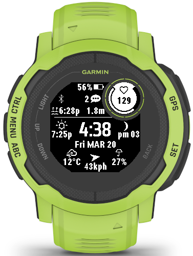
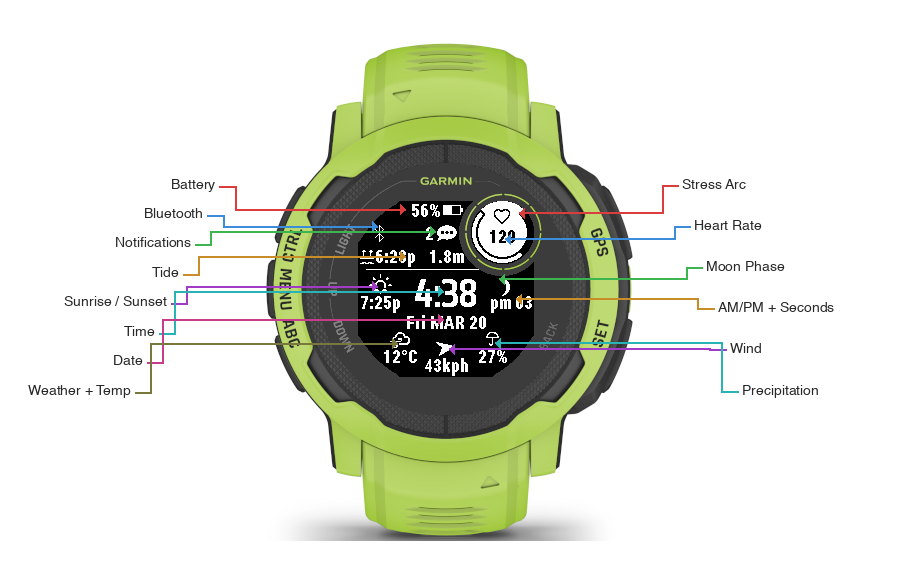

# Shore Watch

A surfer-focused watch face for the Garmin Instinct 2X Solar. Tide times, weather, wind, moon phase, and fitness metrics — all on one screen, no menus.

Built by a surfer for his own wrist, spec-driven with AI assistance. The entire project was designed and implemented using a spec-first methodology: requirements, technical design, and task list were written before any code. An AI agent (Kiro) then implemented the tasks against those specs. The specs and steering files are included in the repo so anyone can fork it, point an AI agent at the docs, and customize their own watch face.

> **Target device:** Garmin Instinct 2X Solar (176x176 MIP, 2-color black & white)

## Screenshot



## Features

- **Time** — large custom font (Saira Condensed Bold or Rajdhani Bold, switchable via settings), seconds on wrist raise
- **Date** — day of week + month + day
- **Bluetooth** — connectivity icon, visible when phone is paired and connected
- **Heart rate** — BPM with heart icon. Sampled by the optical sensor every ~15 seconds at rest; up to every second during wrist movement (high-power mode)
- **Stress** — arc gauge around the HR circle, fills clockwise as stress increases (0-100%). Updated every ~3 minutes from Garmin's stress algorithm
- **Battery** — percentage + proportional fill bar icon
- **Notifications** — count + speech bubble icon
- **Tide** — next high/low time, direction icon, predicted height (via StormGlass API, MLLW datum)
- **Sunrise/Sunset** — next event time with directional icon (via OpenWeatherMap API)
- **Weather** — condition icon with day/night variants, temperature (via OpenWeatherMap API)
- **Wind** — procedural arrow rotated to exact degree, speed in kph/mph (via OpenWeatherMap API)
- **Precipitation** — umbrella icon + chance % (from Garmin built-in weather)
- **Moon phase** — 28-phase icon computed locally from synodic period

## User Guide

### Screen Layout



The watch face is divided into four zones:

**Top section** (left of HR circle)
- Row 1: Battery percentage + fill bar icon
- Row 2: Bluetooth icon (visible when phone is connected) + notification count + speech bubble icon
- Row 3: Tide direction icon (waves-up for high, waves-down for low) + next tide time + predicted height

**HR circle** (top-right, aligned with the physical sub-screen)
- Heart icon + BPM reading
- Stress arc: fills clockwise from 2 o'clock to 10 o'clock as stress increases (0-100%). The arc frame is always visible; the black fill represents your current stress level.

**Middle section**
- Left: next sunrise (↑) or sunset (↓) icon + time
- Center: current time in large font
- Right: moon phase icon, AM/PM indicator, seconds (visible on wrist raise only)

**Bottom section**
- Date row: day of week + month (uppercase) + day number
- Weather widget (3 columns): weather condition icon + temp | wind arrow + speed | umbrella + precipitation %

### Icon Reference

| Icon | Meaning |
|------|---------|
| ☀/☁/🌧 etc. | Weather condition (29 variants, day/night aware) |
| ↑ waves | Next tide is high |
| ↓ wave | Next tide is low |
| ↑ sun | Next event is sunrise |
| ↓ sun | Next event is sunset |
| 🌑→🌕→🌑 | Moon phase (28 phases, updates daily) |
| Arrow | Wind direction (points where wind blows FROM) |
| ☂ | Precipitation chance |
| ♥ | Heart rate |
| Arc around HR | Stress level (more black = more stress) |

### Seconds Display

Seconds are hidden by default to save battery. They appear automatically when you raise your wrist (high-power mode) and hide again when your wrist drops (low-power mode).

### Data Refresh Rates

| Data | Source | Refresh |
|------|--------|---------|
| Time, battery, notifications, BT | Watch sensors | Every second |
| Heart rate | Optical HR sensor | ~Every 15s at rest, up to 1s on wrist movement |
| Stress | Garmin stress algorithm | ~Every 3 minutes |
| Weather, wind, sunrise/sunset | OpenWeatherMap API | Every 30 min or 5km move |
| Precipitation | Garmin built-in weather | Every second (cached by OS) |
| Tide | StormGlass API | Once per day or 50km move |
| Moon phase | Local computation | Every second (cheap math) |

## Setup

### 1. Get API Keys

**OpenWeatherMap** (weather, wind, sunrise/sunset):
1. Sign up at [openweathermap.org](https://openweathermap.org/api)
2. Subscribe to the **One Call API 3.0** (free tier: 1,000 calls/day)
3. Copy your API key

**StormGlass** (tide data):
1. Sign up at [stormglass.io](https://stormglass.io/)
2. Get your API key from the dashboard (free tier: 10 calls/day)
3. Copy your API key

### 2. Configure the Watch Face

Open the **Garmin Connect** app on your phone → Devices → Instinct 2X Solar → Watch Faces → Shore Watch → Settings:

| Setting | Description |
|---------|-------------|
| OWM API Key | Your OpenWeatherMap API key |
| StormGlass API Key | Your StormGlass API key |
| Home Latitude | Fallback latitude if GPS is unavailable (e.g., `33.8688`) |
| Home Longitude | Fallback longitude if GPS is unavailable (e.g., `151.2093`) |
| Clock Font | 0 = Saira Condensed Bold (default), 1 = Rajdhani Bold |

Home coordinates are optional — the watch uses GPS when available. Set them if you want tide/weather data when indoors without a GPS fix.

## Installation

### From Connect IQ Store (recommended)

Search for **"Shore Watch"** in the [Connect IQ Store](https://apps.garmin.com/), or install directly from the app listing page.

### Sideload (development)

1. Build the `.prg` file (see Build from Source below)
2. Connect your watch via USB
3. Copy the `.prg` to `GARMIN/APPS/` on the watch
4. Disconnect and select the watch face on the device

> **Note:** Sideloaded apps cannot receive settings from the Garmin Connect app. Install from the store for full settings support.

## Build from Source

### Prerequisites

- [Connect IQ SDK](https://developer.garmin.com/connect-iq/sdk/) (9.1.0 or later)
- [VS Code](https://code.visualstudio.com/) with the [Monkey C extension](https://marketplace.visualstudio.com/items?itemName=garmin.monkey-c)
- Java 17 (e.g., Amazon Corretto)

### Build and Run

1. Clone the repo: `git clone https://github.com/leomnovaes/surfer-watch-face-garmin.git`
2. Open the folder in VS Code
3. Launch the Connect IQ simulator (ConnectIQ.app)
4. Press **F5** to build and deploy to the simulator
5. To build for the physical device: `Monkey C: Build for Device` from the command palette

## Customize with AI

This repo is designed to be a starting point for your own watch face. The spec-driven architecture means an AI agent can understand the entire project by reading a few files.

### How it works

1. **Fork this repo**
2. **Point your AI agent at the steering files:**
   - `.kiro/steering/product.md` — what the watch face does
   - `.kiro/steering/tech.md` — technology stack, APIs, Monkey C patterns
   - `.kiro/steering/structure.md` — project structure and conventions
3. **Read the spec files:**
   - `.kiro/specs/watch-face/requirements.md` — what each feature should do
   - `.kiro/specs/watch-face/design.md` — pixel coordinates, class architecture, data flow, icon pipeline
   - `.kiro/specs/watch-face/tasks.md` — what's been built and what remains
4. **Tell the agent what you want to change** — new layout, different data sources, additional device support, etc.

The agent can modify the specs first, then implement against them. This is the same workflow used to build the original watch face.

### What you can customize

- Layout positions (all coordinates are constants at the top of `SurferWatchFaceView.mc`)
- Clock font (add your own via the rasterization pipeline)
- Icon set (swap or add icons using the BMFont pipeline in design §5.1)
- Data sources (replace OWM/StormGlass with other APIs)
- Target device (update `manifest.xml` and adjust coordinates for different screen sizes)
- Wind arrow shape (tweak `WIND_ARROW_SIZE`, `WIND_ARROW_WIDTH`, `WIND_ARROW_NOTCH` constants)

### Adding device support

This watch face was built for one specific watch on one surfer's wrist. If you want to support other Garmin devices, you can create your own specs on top of ours — the spec-driven pattern scales to multi-device projects.

## Icon Rasterization Pipeline

Custom icons are rasterized from TTF fonts to Garmin's BMFont format. The full pipeline is documented in `design.md` §5.1. Quick summary:

```bash
# 1. Rasterize from TTF (fontbm binary in tools/)
tools/fontbm --font-file <source.ttf> --font-size 17 \
  --chars <codepoints> --texture-size 256x256 --output /tmp/icons

# 2. Convert to 8-bit grayscale (required for Garmin MIP displays)
magick /tmp/icons_0.png -alpha extract -type grayscale -depth 8 resources/fonts/icons.png

# 3. Edit .fnt: remap char IDs to ASCII, set alphaChnl=1 redChnl=0 greenChnl=0 blueChnl=0
```

Key constraints:
- PNG must be 8-bit grayscale (not RGBA) — Garmin reads grayscale as alpha
- Max texture size on Instinct 2X: 256x256
- 17px is the sweet spot for icon size at FONT_XTINY row height

## Credits

- **Weather Icons** by [Erik Flowers](https://github.com/erikflowers/weather-icons) (SIL OFL 1.1) — weather + moon glyphs
- **Material Design Icons** by [Templarian](https://github.com/Templarian/MaterialDesign) (Apache 2.0) — umbrella, tide icons
- **Crystal Face** by [warmsound](https://github.com/warmsound/crystal-face) (GPL v3) — notification, sunrise/sunset icons
- **Segment34mkII** by [ludw](https://github.com/ludw/Segment34mkII) — Bluetooth icon
- **Garmin Connect Icons** by [sunpazed](https://github.com/sunpazed/garmin-iconfonts) — heart icon
- **Saira Condensed** and **Rajdhani** from [Google Fonts](https://fonts.google.com/) (SIL OFL 1.1) — clock fonts

See [LICENSES.md](LICENSES.md) for full third-party license details.

## License

[MIT](LICENSE) — free to use, modify, and distribute.
